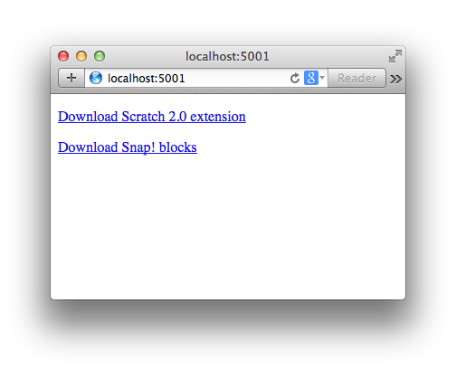
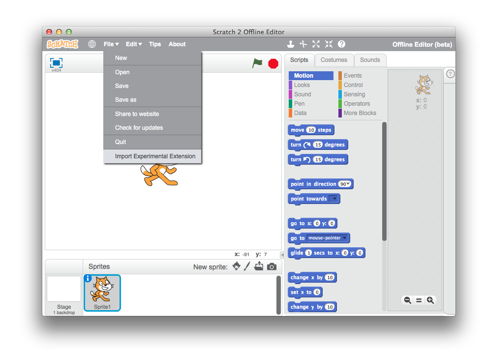
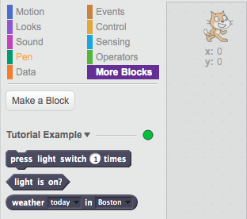
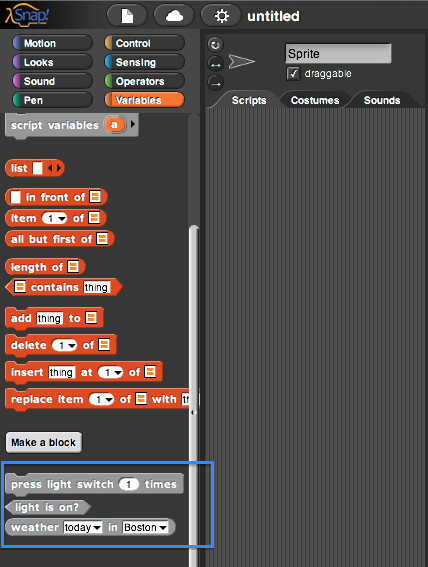
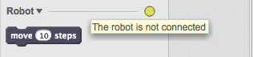

Blockext is a Python library for writing Scratch 2.0 (and Snap!) extensions.

An extension is a set of additional blocks that can be used in Scratch to call
external functions. This lets you send commands from Scratch or read values
into Scratch that you can't do otherwise.

For example, you can use an extension to control hardware connected to
your computer, such as a Lego Mindstorms robot. Or you could use an extension
to connect to a web service to read weather forecasts into Scratch.

<!--
# Installation

<s>Download and extract [blockext.zip](/TODO).</s> TODO

Run:

    $ sudo python setup.py install
-->

# Tutorial

To add an extension block to Scratch, you need to do two things. First, you
write the Python code that implements the block's functionality. Then, you need
to tell Scratch about the block, so it knows how to use it.

In Blockext, those two steps are separate:

* First, you define a class. This is an ordinary Python class where each method
  contains the code for an extension block.

* Next, you create a `Descriptor` object. This stores information about the
  extension. It tells Scratch how to connect to the extension, and the list of
  blocks that Scratch can use.

Finally, you bring them together in an `Extension` object.

Let's see an example!

    from blockext import *

    class Tutorial:
        def __init__(self):
            self.light = False

        def do_toggle_light(self, times):
            for i in range(times):
                self.light = not self.light

        def is_light_on(self):
            return self.light

        def get_weather(self, day, city):
            import random
            return random.choice(["sunny", "cloudy", "windy"])

    descriptor = Descriptor(
        name = "Tutorial Example",
        port = 5001,
        blocks = [
            Block('do_toggle_light', 'command', 'press light switch %n times',
                defaults=[1])
            Block('is_light_on', 'predicate', 'light is on?'),
            Block('get_weather', 'reporter', 'weather %m.day in %m.city'),
        ],
        menus = dict(
            day = ["today", "yesterday"],
            city = ["Barcelona", "Boston", "Bournemouth"],
        ),
    )

    extension = Extension(Tutorial, descriptor)

    if __name__ == '__main__':
        extension.run_forever(debug=True)

This is a pretty simple extension, with only three blocks.

It's a little confused about its identity -- it provides *both*
weather-forecasting and light-switching functionality -- even though we
normally like our extensions to be very focused (just support one piece of
hardware). But we'll forgive it that for now.

Let's see how it works...

    from blockext import *

This probably looks familiar: it just imports the blockext library so we can
use it.

    class Tutorial:
        def __init__(self):
            self.light = False

        def do_toggle_light(self, times):
            for i in range(times):
                self.light = not self.light

        def is_light_on(self):
            return self.light

        def get_weather(self, day, city):
            import random
            return random.choice(["sunny", "cloudy", "windy"])

This defines the class for the extension code. It has three methods, since it
contains code for three blocks.

* `do_toggle_light` flips the "light" variable by the number of times Scratch
  tells it to.
* `is_light_on` returns a boolean (true/false) value indicating whether or not
  the light is currently on.
* `get_weather` contains some very accurate weather-forecasting code.

_This sentence is here because Markdown sucks._

    descriptor = Descriptor(
        name = "Tutorial Example",
        port = 5001,
        blocks = [
            Block('do_toggle_light', 'command', 'press light switch %n times',
                defaults=[1])
            Block('is_light_on', 'predicate', 'light is on?'),
            Block('get_weather', 'reporter', 'weather %m.day in %m.city'),
        ],
        menus = dict(
            day = ["today", "yesterday"],
            city = ["Barcelona", "Boston", "Bournemouth"],
        ),
    )

This makes the descriptor object. We specify the name and port, list the blocks,
and give the menu options.

* The `name` will be displayed in the Scratch interface.
* The `port` is used to connect to Scratch. It can be any integer greater than
  1024.
* `blocks` is a list of `Block` objects.

The `Block` objects are important, so let's take a closer look.

    Block('do_toggle_light', 'command', 'press light switch %n times',
        defaults=[1])

It has the following arguments:

* The _selector_ corresponds to the method name on the `Tutorial` class.
  Scratch uses it to tell blockext which block it wants to run.

* The _shape_ determines the kind of values the block reports.

    * `"command"` -- Doesn't report a value. (puzzle-piece)
    * `"reporter"` -- Reports a number. (round ends)
    * `"predicate"` -- Reports a boolean. (pointy ends)

* The _spec_ is a string identifying the labels and inputs to the block.

    Words starting with "%" produce input slots. Supported input types are:

        * `%n` -- number input (round ends)
        * `%s` -- string input (square ends)
        * `%b` -- boolean input (pointy ends)
        * `%m.menuName` -- menu input
        * `%d.menuName` -- editable number input with menu

    The last two input slots produce a drop-down menu. The options are taken
    from the set of menu options given to `Descriptor`.

* The _defaults_ give default values for the block's inputs.

Finally, we create and run the extension:

    extension = Extension(Tutorial, descriptor)

    if __name__ == '__main__':
        extension.run_forever(debug=True)

This runs the extension in debug mode. The `__name__ == '__main__'` part makes
sure that we can import the Python file without running the extension (which is
important for the launcher, as we'll see later on).

## Importing

Okay -- let's try it out! Save and run the Python file, and point your browser
at <http://localhost:5001>. You should see the following page:

Hit one of those links to download the blocks, and head to the relevant section
to figure out how to load the extension into your favourite program:

* [Scratch](#scratch)
* [Snap!](#snap)

### Scratch

Open the [Scratch 2 Offline Editor](http://scratch.mit.edu/scratch2download/).

Shift-click the "File" menu, and select "Import Experimental Extension".

Select the `.s2e` file you just downloaded to load the extension blocks into
Scratch.

You can then select the "More Blocks" tab to see your blocks.

### Snap!

Open <http://snap.berkeley.edu/run> in your browser.

Drag the `.xml` file you just downloaded into the Snap! window.

(If that doesn’t work, use "Import" from the "File" menu instead.)

You can then select the "Variables" tab to see your blocks.

## Using the blocks

You can click any of the blocks to test them out, just like the built-in
Scratch/Snap! blocks.

Try "say"-ing the "light is on?" and "weather forecast" blocks, and try using
the "press switch" block to change the value of the light reporter.

## Next steps

Congrats! You now know everything you need to write an extension that connects
to Scratch in order to control Python code of your own devising.

The next step is to find a Python library for whatever hardware (or software)
you want to interface with Scratch, and write block implementations!

But don't forget to come back and read on -- there's some useful stuff about
what to do when the hardware isn't connected, and how to remove or change
blocks while maintaining backwards-compatibility.

# Connected?

What we've done so far works fine as long as the hardware's always available.
But imagine the following extension:

    class MyRobot:
        def __init__(self):
            self.robot = Robot.connect()

        def do_move(self, distance):
            self.robot.walk_forward(distance)

At first, this looks fine. But connecting to the hardware inside your class's
`__init__` method is a stunningly bad idea:

* If the hardware gets unplugged at any point, `do_move` will throw an error.

* Worse, if the hardware isn't plugged in when the extension starts up, then
  we'll never connect to the hardware at all!

* And all the while, the user has no idea what's going on -- they just see that
  the "move" block suddenly stops working, with no explanation.

To make our extensions proof against not-connected-ness, we need to do two
things:

* Have a sensible mechanism for automatically reconnecting to the hardware _at
  any time_.
* If we're currently disconnected, tell the Scratch user about it!

To solve these problems, you need to write specially-named methods on your
class. Let's see how they work!

## Reconnecting

To solve the problem of automatically reconnecting, make a method called
`_is_connected`.

Every time Scratch/Snap! wants to run a block, Blockext will call that method
first. If it returns `True`, blockext will carry on as usual.  If it returns
`False`, blockext will give up, since calling the block will likely raise an
error. But it will keep trying at regular intervals, until method returns
`True` again.

This method is entirely optional. If you leave it out, blockext will act as if
it always returns `True`, and behave as normal.

The method looks something like this:

    class MyRobot:
        def __init__(self):
            self.robot = None

        def _is_connected(self):
            if self.robot.has_gone_away():
                self.robot = False

            if not self.robot:
                try:
                    self.robot = Robot.connect()
                except RobotNotFound:
                    pass

            return bool(self.robot)

        ...

Obviously the robot API is entirely made up; this is just supposed to suggest
what the method might look like.

## Problems

Now we're automatically reconnecting, we just need to tell the user our current
status. To do this, make a method called `_problem`.

If there's a problem, it should return a string describing the problem, which
should help the Scratch user troubleshoot. If everything's working correctly,
it should just return `None`.

Again, this method is entirely optional. If you leave it out, blockext will act
as if it always returns `None`.

Here's what it might look like:

    class MyRobot:
        ...

        def _problem(self):
            if not self.robot:
                return "The robot is not connected"

        ...

This method is currently only supported by Scratch.

As long as it returns `None`, the traffic light-colored status indicator displayed
next to the extension name will remain green, indicating Scratch is connected
to the extension and the extension is connected to the hardware.

If it instead returns a string, the status indicator will turn from green to
yellow, indicating Scratch is connected to the extension, but the extension is
not connected to the hardware. Hovering over the indicator will display a
tooltip with the string returned by `_problem`.

# Extras

## Reset

There is a third specially-named method: `_on_reset`.

This is triggered when the red stop button is clicked in Scratch. It should
reset the extension to its initial state, for example stopping all motors.

This method is currently only supported by Scratch.

## Deprecating blocks

After you release your extension, and people are using it, you may find you
want to change things.

Here are some tips on what _not_ to change, in order to keep backwards
compatibility:

* The **port**. This is part of how Scratch connects to your extension, so you
  should keep it the same.

* Block **selectors**. If you change a block selector, old projects that used
  the previous version of your extension won't work properly any more.

However, you _can_ deprecate blocks without removing them. And if you want to
change how a block works, you can deprecate that block and make a new one with
a new block selector.

Imagine we want to deprecate the "press light switch" block, and replace it
with a block that presses the light switch only once.

We remove the old block from the descriptor, and replace it with the new one:

    descriptor = Descriptor(
        name = "Tutorial Example",
        port = 5001,
        blocks = [
            Block('do_toggle_light_once', 'command', 'press light switch'),
            Block('is_light_on', 'predicate', 'light is on?'),
            Block('get_weather', 'reporter', 'weather %m.day in %m.city'),
        ],
        menus = dict(
            day = ["today", "yesterday"],
            city = ["Barcelona", "Boston", "Bournemouth"],
        ),
    )

Then we add a method for the new block (while keeping the method for the old
one unchanged):

    class Tutorial:
        ...

        def do_toggle_light(self, times):
            for i in range(times):
                self.light = not self.light

        def do_toggle_light_once(self):
            self.light = not self.light
        
        ...

Finally, we give the extension a new argument, `deprecated_blocks`, which is a
list containing the block we removed.

    extension = Extension(Tutorial, descriptor, deprecated_blocks=[
        Block('do_toggle_light', 'command', 'press light switch %n times',
              defaults=[1])
    ])

Now, when we run the extension, it'll still have the code for the old block, so
all the existing projects using our extension will still work -- but when we
load the new version of the extension in Scratch, we'll only see the new block,
and not the old one!

## Rearranging things

You might like to put the block information next to the methods that implement
the block's code. You can do this by using a Python feature called
_decorators_. It looks like this: 

    ...

    class Tutorial:
        def __init__(self):
            self.light = False

        @command('press light switch %n times',
            defaults=[1])
        def do_toggle_light(self, times):
            for i in range(times):
                self.light = not self.light

        @predicate('light is on?'),
        def is_light_on(self):
            return self.light

        @reporter('weather %m.day in %m.city'),
        def get_weather(self, day, city):
            import random
            return random.choice(["sunny", "cloudy", "windy"])

    descriptor = Descriptor(
        name = "Tutorial Example",
        port = 5001,
        blocks = get_decorated_blocks_from_class(Tutorial),
        menus = dict(
            day = ["today", "yesterday"],
            city = ["Barcelona", "Boston", "Bournemouth"],
        ),
    )

    ...

The block selector is magically deduced from the function's name. The
descriptor uses `get_decorated_blocks_from_class()` to magically construct the
blocks list from the decorated functions on the class.

If the function has a docstring, it will also magically use that as the help
text for the block. (The help text is currently only supported by Snap!).

However, be aware that this makes deprecating blocks more awkward.

For example, to deprecate `do_toggle_light` in favour of
`do_toggle_light_once`, you'd now have to do this: 

    class Tutorial:
        ...

        @command('press light switch %n times', defaults=[1])
        def do_toggle_light(self, times):
            for i in range(times):
                self.light = not self.light

        @command('press light switch')
        def do_toggle_light_once(self):
            for i in range(times):
                self.light = not self.light
        ...

    descriptor = Descriptor(
        name = "Tutorial Example",
        port = 5001,
        blocks = get_decorated_blocks_from_class(Tutorial, [
            "do_toggle_light_once",
            "is_light_on",
            "get_weather",
        ]),
        menus = dict(
            day = ["today", "yesterday"],
            city = ["Barcelona", "Boston", "Bournemouth"],
        ),
    )

    extension = Extension(Tutorial, descriptor,
        deprecated_blocks=get_decorated_blocks_from_class(Tutorial, [
            "do_toggle_light",
    ])),

# Translation

_This feature's not quite ready yet. Nearly there though..._

# Launcher

One day, there will be a launcher. You don't need to know how it works, except
for the following:

It will work by importing the `Extension` object from the Python package
containing the extension.

Aside: This is one of the reasons why there are three separate things (your
class, and the `Extension` and `Descriptor` objects): so that the information
is separate from the methods, and the launcher can get to the information.
(The main reason that `Descriptor` is separate from your class is that
otherwise blockext would get confused between extension attributes -- like
`name` and `port` -- and methods implementing block code.)

So it's important that you only run the extension inside the following if
statement:

    if __name__ == '__main__':
        extension.run_forever(debug=True)

The `__name__ == '__main__'` part ensures the extension only runs if you run
the extension file on its own. When the launcher imports the Python file, it'll
ignore the "run" part, so the launcher can take care of running the extension
by itself.

# Troubleshooting

* _I see `UnicodeDecodeError`!_

    This is a general Python problem (specifically, Python 2). Try putting
    this at the top of your file:
    
        # coding=utf-8
        from __future__ import unicode_literals

    You may like to use Python-Future](http://python-future.org) to workaround
    the differences between Python 2 and 3.
